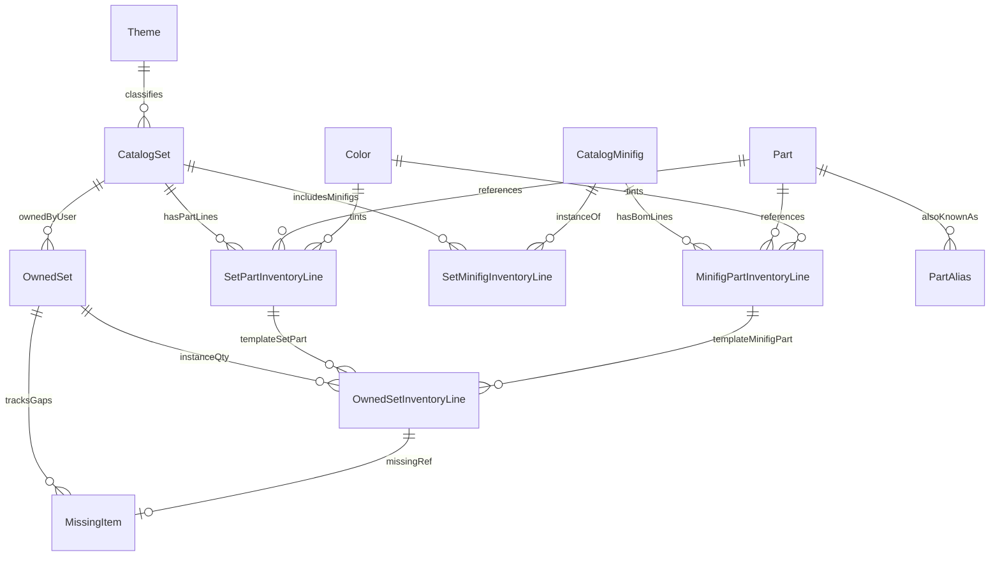

# Database schema — LEGO Collection Manager (MVP)

SQLite is the **single source of truth** for catalog and collection data. Schema follows **normalized** tables with clear separation between **global catalog** (Rebrickable-sourced LEGO data) and **your collection** (rows in `owned_sets`: one per physical copy, investigation state, missing parts, and user-uploaded images as BLOBs). All importable rows carry **source metadata**.

**Product invariant:** there is no LEGO set in the DB that is not represented by at least one **`owned_sets`** row. **`catalog_sets`** is shared metadata/template for a `set_num` while you have one or more copies.

## Environment

| Variable | Purpose |
|----------|---------|
| `DATABASE_URL` | SQLAlchemy URL; MVP default `sqlite:///./data/lego.db` (path relative to backend working directory). |

User-uploaded images are stored in SQLite BLOB columns on `parts` and `catalog_sets` (see [data-sources.md](./data-sources.md)); no filesystem upload root is required after Phase 10.

Migrations: **Alembic** tracks revisions; application startup fails fast if the DB is not at head (per [development-plan.md](./development-plan.md)).

## Design principles

1. **Catalog vs collection:** Catalog tables mirror importer entities; collection tables reference catalog by foreign key.
2. **Many copies per set number:** Multiple `owned_sets` rows may reference the same `catalog_sets.id` (several physical copies, complete or not).
3. **No duplicate catalog primaries:** Upserts keyed by natural keys (`set_num`, `part_num`, `color_id` from API, etc.).
4. **Inventory fidelity:** Stickered vs plain and distinct Rebrickable part numbers are preserved on line tables—**no collapsing** of lines in MVP. Rebrickable **spare** and **alternate** rows are read from the API but **not stored** (see [data-sources.md](./data-sources.md)).
5. **Missing parts** belong to a **set copy** (`owned_sets` row) and reference a **specific per-copy inventory line** (set-level part row or minifig BOM row) for traceability in the UI.
6. **User images:** At most one JPEG/PNG BLOB per `parts` row (global part image) and per `catalog_sets` row (shared set box image). Missing-line uploads attach to the part record.

## Entity-relationship overview

## Tables

### `themes`

| Column | Type | Notes |
|--------|------|--------|
| `id` | INTEGER PK | Surrogate key. |
| `external_id` | INTEGER UNIQUE | Rebrickable `theme_id`. |
| `name` | TEXT NOT NULL | Theme name. |
| `source` | TEXT NOT NULL | e.g. `rebrickable`. |
| `fetched_at` | TIMESTAMP NOT NULL | UTC. |

### `catalog_sets`

| Column | Type | Notes |
|--------|------|--------|
| `id` | INTEGER PK | Surrogate key. |
| `set_num` | TEXT NOT NULL UNIQUE | Business key; matches Rebrickable. |
| `name` | TEXT NULL | From API; NULL allowed for **CSV stub** rows until first sync. |
| `year` | INTEGER NULL | |
| `theme_id` | INTEGER FK → `themes.id` NULL | |
| `num_parts` | INTEGER NULL | From API if provided. |
| `image_url` | TEXT NULL | Rebrickable CDN URL when synced (not downloaded in Phases 9–13). |
| `image_blob` | BLOB NULL | User-uploaded set box image (JPEG/PNG). |
| `image_content_type` | TEXT NULL | `image/jpeg` or `image/png` when `image_blob` set. |
| `image_byte_size` | INTEGER NULL | Byte length of `image_blob`. |
| `source` | TEXT NOT NULL | e.g. `csv_import` (stub) or `rebrickable`. |
| `source_ref` | TEXT NOT NULL | Typically same as `set_num`. |
| `fetched_at` | TIMESTAMP NOT NULL | UTC. |

**CSV import:** may insert **minimal stub** rows (`set_num`, `source` = `csv_import`, `source_ref` = `set_num`, `fetched_at`, other fields NULL) so `owned_sets` can reference `catalog_set_id` before the first Rebrickable sync; sync then upserts full metadata and inventories.

### `owned_sets`

Represents **one physical copy** the user owns of a catalog set. **Many rows** may share the same `catalog_set_id`.

| Column | Type | Notes |
|--------|------|--------|
| `id` | INTEGER PK | Surrogate key; exposed in API and UI. |
| `catalog_set_id` | INTEGER FK → `catalog_sets.id` NOT NULL | **Not unique** — multiple physical copies per LEGO set number. |
| `investigated` | BOOLEAN NOT NULL DEFAULT 0 | `false` for new CSV imports and UI duplicates until user marks investigated. |
| `label` | TEXT NULL | Optional user label to distinguish copies (e.g. “Copy #2”, “eBay lot — incomplete”). When NULL, the UI shows a default of `Copy #n` where `n` is the 1-based copy index among rows sharing this `catalog_set_id` (ordered by `created_at`, then `id`). |
| `age` | INTEGER NULL | Recommended minimum age as a **number** (e.g. `6` parsed from Rebrickable `6+` when the API exposes `age_range`). Rebrickable **often omits** age — then the user fills it on set detail (`PATCH`). When saved, the same value is written to **all copies** sharing this `catalog_set_id`. UI shows `?` when NULL. |
| `created_at` | TIMESTAMP NOT NULL | When this copy was first recorded. |
| `notes` | TEXT NULL | Optional free-text note. |

**Index:** `(catalog_set_id)` for listing all copies of a set number.

**Duplicate row (UI/API):** `POST /owned-sets/{id}/duplicate` inserts a new row with the same `catalog_set_id`, `investigated` = `false`, user-confirmed `label` (default `Copy #n` where `n` = existing copy count + 1), `age` and `notes` = NULL, and **no** `missing_items`. The source row is unchanged. The UI shows a confirmation dialog before POST; provenance of “copied from” is optional in the API response only (no extra column required in MVP).

**Delete copy (UI/API):** `DELETE /owned-sets/{id}` removes the `owned_sets` row, cascades `missing_items` and `owned_set_inventory_lines`. If this was the **last** row for a `catalog_set_id`, also delete that catalog set and its inventory rows (full removal from the database, including any set BLOB image on that catalog row).

### `parts`

| Column | Type | Notes |
|--------|------|--------|
| `id` | INTEGER PK | |
| `part_num` | TEXT NOT NULL UNIQUE | Rebrickable primary part id. |
| `name` | TEXT NULL | |
| `image_url` | TEXT NULL | Rebrickable element URL when synced. |
| `image_blob` | BLOB NULL | User-uploaded part image (JPEG/PNG). |
| `image_content_type` | TEXT NULL | Stored MIME type when `image_blob` set. |
| `image_byte_size` | INTEGER NULL | Byte length of `image_blob`. |
| `source` | TEXT NOT NULL | |
| `source_ref` | TEXT NOT NULL | Typically `part_num`. |
| `fetched_at` | TIMESTAMP NOT NULL | |

**Stickered vs plain:** different `part_num` values → different `parts` rows. Updating a part image affects every inventory line referencing that `part_id`.

### `part_aliases`

Supports search and cross-references when Rebrickable exposes alternate identifiers.

| Column | Type | Notes |
|--------|------|--------|
| `id` | INTEGER PK | |
| `part_id` | INTEGER FK → `parts.id` NOT NULL | |
| `alias` | TEXT NOT NULL | Alternate string. |
| `source` | TEXT NOT NULL | |
| `UNIQUE(part_id, alias, source)` | | One row per alias string per part and source (symmetric user closure). |

### `colors`

| Column | Type | Notes |
|--------|------|--------|
| `id` | INTEGER PK | |
| `external_id` | INTEGER UNIQUE | Rebrickable `color_id`. |
| `name` | TEXT NOT NULL | |
| `rgb` | TEXT NULL | If provided. |
| `source` | TEXT NOT NULL | |
| `fetched_at` | TIMESTAMP NOT NULL | |

### `set_part_inventory_lines`

Direct **set → part** inventory (not inside a minifig BOM).

| Column | Type | Notes |
|--------|------|--------|
| `id` | INTEGER PK | |
| `catalog_set_id` | INTEGER FK → `catalog_sets.id` NOT NULL | |
| `part_id` | INTEGER FK → `parts.id` NOT NULL | |
| `color_id` | INTEGER FK → `colors.id` NOT NULL | |
| `quantity` | INTEGER NOT NULL | Must be > 0. |
| `image_url` | TEXT NULL | Element image for this color. |
| `source` | TEXT NOT NULL | |
| `source_ref` | TEXT NULL | Optional stable id from API if present. |
| `fetched_at` | TIMESTAMP NOT NULL | |
| **UNIQUE** | | `(catalog_set_id, part_id, color_id)` |

### `catalog_minifigs`

| Column | Type | Notes |
|--------|------|--------|
| `id` | INTEGER PK | |
| `minifig_num` | TEXT NOT NULL UNIQUE | e.g. `fig-000001`. |
| `name` | TEXT NULL | |
| `image_url` | TEXT NULL | |
| `source` | TEXT NOT NULL | |
| `fetched_at` | TIMESTAMP NOT NULL | |

### `set_minifig_inventory_lines`

Which minifigs appear in a set and how many.

| Column | Type | Notes |
|--------|------|--------|
| `id` | INTEGER PK | |
| `catalog_set_id` | INTEGER FK → `catalog_sets.id` NOT NULL | |
| `catalog_minifig_id` | INTEGER FK → `catalog_minifigs.id` NOT NULL | |
| `quantity` | INTEGER NOT NULL | |
| `source` | TEXT NOT NULL | |
| `fetched_at` | TIMESTAMP NOT NULL | |
| **UNIQUE** | | `(catalog_set_id, catalog_minifig_id)` |

### `minifig_part_inventory_lines`

BOM: parts belonging to a minifig design.

| Column | Type | Notes |
|--------|------|--------|
| `id` | INTEGER PK | |
| `catalog_minifig_id` | INTEGER FK → `catalog_minifigs.id` NOT NULL | |
| `part_id` | INTEGER FK → `parts.id` NOT NULL | |
| `color_id` | INTEGER FK → `colors.id` NOT NULL | |
| `quantity` | INTEGER NOT NULL | |
| `image_url` | TEXT NULL | |
| `source` | TEXT NOT NULL | |
| `fetched_at` | TIMESTAMP NOT NULL | |
| **UNIQUE** | | `(catalog_minifig_id, part_id, color_id)` |

### `missing_items`

Per **set copy**, links to **one** `owned_set_inventory_lines` row when the user has marked that line as missing (photo optional; stored on `parts.image_blob`).

| Column | Type | Notes |
|--------|------|--------|
| `id` | INTEGER PK | |
| `owned_set_id` | INTEGER FK → `owned_sets.id` NOT NULL | |
| `owned_set_inventory_line_id` | INTEGER FK → `owned_set_inventory_lines.id` NOT NULL | |
| `created_at` | TIMESTAMP NOT NULL | |
| `updated_at` | TIMESTAMP NOT NULL | |
| **UNIQUE** | | `owned_set_inventory_line_id` — at most one missing row per copy’s inventory line. |

`quantity_missing` lives on `owned_set_inventory_lines`, not on `missing_items`. Clearing missing to zero removes the `missing_items` row; the part BLOB remains until explicitly deleted via the part image API.

## Indexes (search and joins)

| Table | Index | Purpose |
|-------|-------|---------|
| `catalog_sets` | `set_num` | Unique lookup; search by set number. |
| `parts` | `part_num` | Lookup; prefix search helper. |
| `part_aliases` | `alias` | Search by alternate id. |
| `set_part_inventory_lines` | `(catalog_set_id)` | Set detail parts query. |
| `set_minifig_inventory_lines` | `(catalog_set_id)` | Set detail minifigs. |
| `minifig_part_inventory_lines` | `(catalog_minifig_id)` | Expand minifig BOM. |
| `owned_sets` | `(catalog_set_id)` | Join owned → catalog; count copies per set. |
| `owned_sets` | `(investigated)` | Optional filter uninvestigated copies. |

SQLite full-text (FTS5) is **optional post-MVP**; MVP may use `LIKE` with normalized uppercase column `part_num_norm` / `alias_norm` populated on write for simpler indexing.

## Deletion and orphan rules

- Deleting an `owned_set` deletes its `missing_items` and `owned_set_inventory_lines` (CASCADE).
- Deleting a `missing_items` row does not clear the global part BLOB; use `DELETE /parts/{id}/image` for that.
- Catalog rows are generally **not** deleted on failed sync; importer updates in place. The app does **not** keep “catalog-only” sets you do not track in the collection.

---

## Post-MVP schema (Phases 9+)

### Per-copy inventory (`owned_set_inventory_lines`, Phase 9 — implemented)

Catalog inventory lines stay on `catalog_sets` as the **template** (from Rebrickable or manual entry). Implemented table **`owned_set_inventory_lines`**:

| Column | Type | Notes |
|--------|------|--------|
| `id` | INTEGER PK | |
| `owned_set_id` | INTEGER FK → `owned_sets.id` NOT NULL | |
| `set_part_inventory_line_id` | INTEGER FK NULL | Exactly one line FK set per row (set-part or minifig-part). |
| `minifig_part_inventory_line_id` | INTEGER FK NULL | |
| `quantity` | INTEGER NOT NULL | Expected qty **for this physical copy**; > 0. |
| `quantity_missing` | INTEGER NOT NULL DEFAULT 0 | 0 ≤ value ≤ `quantity`. |

Creating a copy (CSV, duplicate, manual add) **copies** template lines into per-copy rows. `missing_items` references `owned_set_inventory_line_id` when `quantity_missing` > 0; `quantity_missing` lives on that line.

### Images in SQLite (Phase 10 — implemented)

BLOB columns on `parts` and `catalog_sets` (see table definitions above). Constraints: JPEG or PNG; max **5_242_880** bytes (5 MB); min size **0** allowed. `missing_items.image_path` removed in migration `e1b4c7d29f50`.

Serving: `GET /parts/{part_id}/image`, `GET /catalog-sets/{catalog_set_id}/image`, and `GET /media/missing/{missing_item_id}` (part BLOB when missing qty > 0). See [api-design.md](./api-design.md).

### Part aliases (Phase 11B)

Keep `part_aliases` table; manual writes use `source='user'`. `PATCH /parts/{part_id}/aliases` enforces **symmetric closure** within an alias equivalence class (see [product-requirements.md §11.5](./product-requirements.md#115-part-aliases-bidirectional)).

`GET /owned-sets/{id}` exposes `aliases: string[]` on each `set_parts` line — derived from `part_aliases` for that `part_id` (excluding `part_num`), not a separate column.

### Collection invariant (Phase 13)

Enforce at application layer: `catalog_sets` without any `owned_sets` must not exist after commits (except transient transactions).

## Related documents

- [README.md](./README.md) — index of all specification files in `docs/`
- [data-sources.md](./data-sources.md)
- [api-design.md](./api-design.md)
- [testing-strategy.md](./testing-strategy.md)
