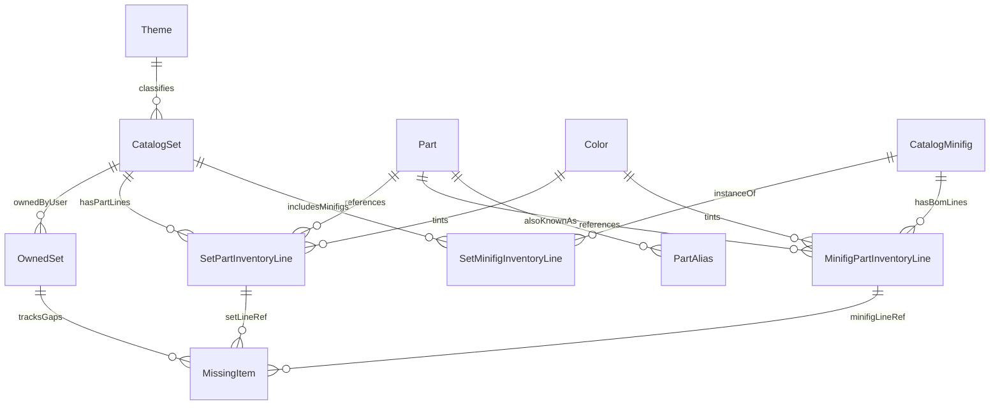

# Database schema — LEGO Collection Manager (MVP)

SQLite is the **single source of truth** for catalog and collection data. Schema follows **normalized** tables with clear separation between **global catalog** (Rebrickable-sourced LEGO data) and **user collection** (owned instances, investigation state, missing parts, and local missing-part photos). All importable rows carry **source metadata**.

## Environment

| Variable | Purpose |
|----------|---------|
| `DATABASE_URL` | SQLAlchemy URL; MVP default `sqlite:///./data/lego.db` (path relative to backend working directory). |
| `UPLOAD_ROOT` | Filesystem directory for missing-part images; default `./data/uploads` (see [data-sources.md](./data-sources.md)). |

Migrations: **Alembic** tracks revisions; application startup fails fast if the DB is not at head (per [development-plan.md](./development-plan.md)).

## Design principles

1. **Catalog vs collection:** Catalog tables mirror importer entities; collection tables reference catalog by foreign key.
2. **Many instances per set number:** Multiple `owned_sets` rows may reference the same `catalog_sets.id` (several physical copies, complete or not).
3. **No duplicate catalog primaries:** Upserts keyed by natural keys (`set_num`, `part_num`, `color_id` from API, etc.).
4. **Inventory fidelity:** Spare, alternate, stickered vs plain, and distinct Rebrickable part numbers are preserved on line tables—**no collapsing** of lines in MVP.
5. **Missing parts** belong to an **owned-set instance** and reference a **specific inventory line** (set-level part row or minifig BOM row) for traceability in the UI.
6. **Local missing-part photos:** At most one image file per `missing_items` row, path stored in DB, bytes on disk under `UPLOAD_ROOT`.

## Entity-relationship overview

## Tables

### `themes`

| Column | Type | Notes |
|--------|------|--------|
| `id` | INTEGER PK | Surrogate key. |
| `external_id` | INTEGER UNIQUE | Rebrickable `theme_id`. |
| `name` | TEXT NOT NULL | Theme name. |
| `source` | TEXT NOT NULL | e.g. `rebrickable`. |
| `fetched_at` | TIMESTAMP NOT NULL | UTC. |

### `catalog_sets`

| Column | Type | Notes |
|--------|------|--------|
| `id` | INTEGER PK | Surrogate key. |
| `set_num` | TEXT NOT NULL UNIQUE | Business key; matches Rebrickable. |
| `name` | TEXT NULL | From API; NULL allowed for **CSV stub** rows until first sync. |
| `year` | INTEGER NULL | |
| `theme_id` | INTEGER FK → `themes.id` NULL | |
| `num_parts` | INTEGER NULL | From API if provided. |
| `image_url` | TEXT NULL | Box art or primary image URL. |
| `source` | TEXT NOT NULL | e.g. `csv_import` (stub) or `rebrickable`. |
| `source_ref` | TEXT NOT NULL | Typically same as `set_num`. |
| `fetched_at` | TIMESTAMP NOT NULL | UTC. |

**CSV import:** may insert **minimal stub** rows (`set_num`, `source` = `csv_import`, `source_ref` = `set_num`, `fetched_at`, other fields NULL) so `owned_sets` can reference `catalog_set_id` before the first Rebrickable sync; sync then upserts full metadata and inventories.

### `owned_sets`

Represents **one physical copy** the user owns of a catalog set. **Many rows** may share the same `catalog_set_id`.

| Column | Type | Notes |
|--------|------|--------|
| `id` | INTEGER PK | Surrogate key; exposed in API and UI. |
| `catalog_set_id` | INTEGER FK → `catalog_sets.id` NOT NULL | **Not unique** — multiple instances per set number. |
| `investigated` | BOOLEAN NOT NULL DEFAULT 0 | `false` for new CSV imports and UI duplicates until user marks investigated. |
| `label` | TEXT NULL | Optional user label to distinguish copies (e.g. “Copy #2”, “eBay lot — incomplete”). When NULL, the UI shows a default of `Copy #n` where `n` is the 1-based copy index among rows sharing this `catalog_set_id` (ordered by `created_at`, then `id`). |
| `age` | INTEGER NULL | Recommended age as a **number** (e.g. `6` from Rebrickable `6+`). User may edit on detail; when saved, the same value is written to **all** owned-set instances sharing this `catalog_set_id` (see [product-requirements.md](./product-requirements.md)). UI shows `?` when NULL. |
| `created_at` | TIMESTAMP NOT NULL | When this instance was first recorded. |
| `notes` | TEXT NULL | Optional free-text note. |

**Index:** `(catalog_set_id)` for listing all copies of a set number.

**Duplicate instance (UI/API):** `POST /owned-sets/{id}/duplicate` inserts a new row with the same `catalog_set_id`, `investigated` = `false`, user-confirmed `label` (default `Copy #n` where `n` = existing copy count + 1), `age` and `notes` = NULL, and **no** `missing_items`. The source row is unchanged. The UI shows a confirmation dialog before POST; provenance of “copied from” is optional in the API response only (no extra column required in MVP).

**Delete instance (UI/API):** `DELETE /owned-sets/{id}` removes the owned-set row, cascades `missing_items`, and deletes any missing-part image files on disk. If this was the **last** owned-set row for a `catalog_set_id`, also delete that catalog set and its inventory rows (full removal from the database).

### `parts`

| Column | Type | Notes |
|--------|------|--------|
| `id` | INTEGER PK | |
| `part_num` | TEXT NOT NULL UNIQUE | Rebrickable primary part id. |
| `name` | TEXT NULL | |
| `image_url` | TEXT NULL | |
| `source` | TEXT NOT NULL | |
| `source_ref` | TEXT NOT NULL | Typically `part_num`. |
| `fetched_at` | TIMESTAMP NOT NULL | |

**Stickered vs plain:** different `part_num` values → different `parts` rows.

### `part_aliases`

Supports search and cross-references when Rebrickable exposes alternate identifiers.

| Column | Type | Notes |
|--------|------|--------|
| `id` | INTEGER PK | |
| `part_id` | INTEGER FK → `parts.id` NOT NULL | |
| `alias` | TEXT NOT NULL | Alternate string. |
| `source` | TEXT NOT NULL | |
| `UNIQUE(alias, source)` | | Prevent duplicate alias rows. |

### `colors`

| Column | Type | Notes |
|--------|------|--------|
| `id` | INTEGER PK | |
| `external_id` | INTEGER UNIQUE | Rebrickable `color_id`. |
| `name` | TEXT NOT NULL | |
| `rgb` | TEXT NULL | If provided. |
| `source` | TEXT NOT NULL | |
| `fetched_at` | TIMESTAMP NOT NULL | |

### `set_part_inventory_lines`

Direct **set → part** inventory (not inside a minifig BOM).

| Column | Type | Notes |
|--------|------|--------|
| `id` | INTEGER PK | |
| `catalog_set_id` | INTEGER FK → `catalog_sets.id` NOT NULL | |
| `part_id` | INTEGER FK → `parts.id` NOT NULL | |
| `color_id` | INTEGER FK → `colors.id` NOT NULL | |
| `quantity` | INTEGER NOT NULL | Must be > 0. |
| `is_spare` | BOOLEAN NOT NULL DEFAULT 0 | |
| `is_alternate` | BOOLEAN NOT NULL DEFAULT 0 | |
| `image_url` | TEXT NULL | Element image for this color. |
| `source` | TEXT NOT NULL | |
| `source_ref` | TEXT NULL | Optional stable id from API if present. |
| `fetched_at` | TIMESTAMP NOT NULL | |
| **UNIQUE** | | `(catalog_set_id, part_id, color_id, is_spare, is_alternate)` — if collisions occur in source data, disambiguate with `source_ref` in a follow-up migration. |

### `catalog_minifigs`

| Column | Type | Notes |
|--------|------|--------|
| `id` | INTEGER PK | |
| `minifig_num` | TEXT NOT NULL UNIQUE | e.g. `fig-000001`. |
| `name` | TEXT NULL | |
| `image_url` | TEXT NULL | |
| `source` | TEXT NOT NULL | |
| `fetched_at` | TIMESTAMP NOT NULL | |

### `set_minifig_inventory_lines`

Which minifigs appear in a set and how many.

| Column | Type | Notes |
|--------|------|--------|
| `id` | INTEGER PK | |
| `catalog_set_id` | INTEGER FK → `catalog_sets.id` NOT NULL | |
| `catalog_minifig_id` | INTEGER FK → `catalog_minifigs.id` NOT NULL | |
| `quantity` | INTEGER NOT NULL | |
| `source` | TEXT NOT NULL | |
| `fetched_at` | TIMESTAMP NOT NULL | |
| **UNIQUE** | | `(catalog_set_id, catalog_minifig_id)` |

### `minifig_part_inventory_lines`

BOM: parts belonging to a minifig design.

| Column | Type | Notes |
|--------|------|--------|
| `id` | INTEGER PK | |
| `catalog_minifig_id` | INTEGER FK → `catalog_minifigs.id` NOT NULL | |
| `part_id` | INTEGER FK → `parts.id` NOT NULL | |
| `color_id` | INTEGER FK → `colors.id` NOT NULL | |
| `quantity` | INTEGER NOT NULL | |
| `is_spare` | BOOLEAN NOT NULL DEFAULT 0 | |
| `image_url` | TEXT NULL | |
| `source` | TEXT NOT NULL | |
| `fetched_at` | TIMESTAMP NOT NULL | |
| **UNIQUE** | | `(catalog_minifig_id, part_id, color_id, is_spare)` |

### `missing_items`

Per **owned-set instance**, references **one** inventory line. Optional **local** photo for offline use.

| Column | Type | Notes |
|--------|------|--------|
| `id` | INTEGER PK | |
| `owned_set_id` | INTEGER FK → `owned_sets.id` NOT NULL | |
| `set_part_inventory_line_id` | INTEGER FK → `set_part_inventory_lines.id` NULL | |
| `minifig_part_inventory_line_id` | INTEGER FK → `minifig_part_inventory_lines.id` NULL | |
| `quantity_missing` | INTEGER NOT NULL | > 0; ≤ referenced line `quantity` (enforced in app or trigger). |
| `image_path` | TEXT NULL | Relative path under `UPLOAD_ROOT`; **at most one** image per row; NULL if none. |
| `created_at` | TIMESTAMP NOT NULL | |
| `updated_at` | TIMESTAMP NOT NULL | |
| **CHECK** | | Exactly one of (`set_part_inventory_line_id`, `minifig_part_inventory_line_id`) is NOT NULL. |
| **UNIQUE** | | One active missing row per owned instance + line (same strategy as before; see implementation note below). |

**File naming (implementation):** e.g. `missing/{missing_item_id}.{ext}` under `UPLOAD_ROOT`; replacing upload deletes previous file.

**Implementation note:** If SQLite uniqueness with NULLs becomes painful, replace the two nullable FKs with `inventory_line_type` (`set_part` \| `minifig_part`) + `inventory_line_id` INTEGER + application validation.

## Indexes (search and joins)

| Table | Index | Purpose |
|-------|-------|---------|
| `catalog_sets` | `set_num` | Unique lookup; search by set number. |
| `parts` | `part_num` | Lookup; prefix search helper. |
| `part_aliases` | `alias` | Search by alternate id. |
| `set_part_inventory_lines` | `(catalog_set_id)` | Set detail parts query. |
| `set_minifig_inventory_lines` | `(catalog_set_id)` | Set detail minifigs. |
| `minifig_part_inventory_lines` | `(catalog_minifig_id)` | Expand minifig BOM. |
| `owned_sets` | `(catalog_set_id)` | Join owned → catalog; count copies per set. |
| `owned_sets` | `(investigated)` | Optional filter uninvestigated instances. |

SQLite full-text (FTS5) is **optional post-MVP**; MVP may use `LIKE` with normalized uppercase column `part_num_norm` / `alias_norm` populated on write for simpler indexing.

## Deletion and orphan rules

- Deleting an `owned_set` deletes its `missing_items` (CASCADE) and **removes associated image files** from disk.
- Deleting a `missing_items` row removes its image file if present.
- Catalog rows are generally **not** deleted on failed sync; importer updates in place. Optional future “prune sets no longer owned” job is out of MVP scope.

---

## Planned schema changes (Phases 9–12, not yet implemented)

These tables/columns describe the **target** design for post-MVP work. MVP columns above remain until migrated phase by phase.

### Instance inventory (Phase 9)

Catalog inventory lines stay on `catalog_sets` as the **template** (from Rebrickable or manual entry). New table (name TBD, e.g. `owned_set_inventory_lines`):

| Column | Type | Notes |
|--------|------|--------|
| `id` | INTEGER PK | |
| `owned_set_id` | INTEGER FK → `owned_sets.id` NOT NULL | |
| `set_part_inventory_line_id` | INTEGER FK NULL | Exactly one line FK set per row (set-part or minifig-part). |
| `minifig_part_inventory_line_id` | INTEGER FK NULL | |
| `quantity` | INTEGER NOT NULL | Expected/owned qty for **this instance**; > 0. |
| `quantity_missing` | INTEGER NOT NULL DEFAULT 0 | 0 ≤ value ≤ `quantity`. |

Creating an instance (CSV, duplicate, manual add) **copies** template lines into instance rows. `missing_items` may be folded into `quantity_missing` or kept for photo linkage until Phase 10 — implementers choose one model and document in migration notes.

### Images in SQLite (Phase 10)

| Table | New columns | Notes |
|-------|-------------|--------|
| `parts` | `image_blob` BLOB NULL, `image_content_type` TEXT NULL, `image_byte_size` INTEGER NULL | One image per part globally. |
| `catalog_sets` | `image_blob`, `image_content_type`, `image_byte_size` | Set box art; shared by all instances. |

Constraints: JPEG or PNG; max **5_242_880** bytes (5 MB); min size **0** allowed. Remove `missing_items.image_path` and stop using `UPLOAD_ROOT` after migration.

Serving: `GET` endpoints return bytes with `Content-Type` from stored metadata (see planned [api-design.md](./api-design.md)).

### Part aliases (Phase 12)

Keep `part_aliases` table; all write paths enforce **symmetric closure** within an alias equivalence class (see [product-requirements.md §11.5](./product-requirements.md#115-part-aliases-bidirectional)).

### Collection invariant (Phase 12)

Enforce at application layer: `catalog_sets` without any `owned_sets` must not exist after commits (except transient transactions).

## Related documents

- [README.md](./README.md) — index of all specification files in `docs/`
- [data-sources.md](./data-sources.md)
- [api-design.md](./api-design.md)
- [testing-strategy.md](./testing-strategy.md)
