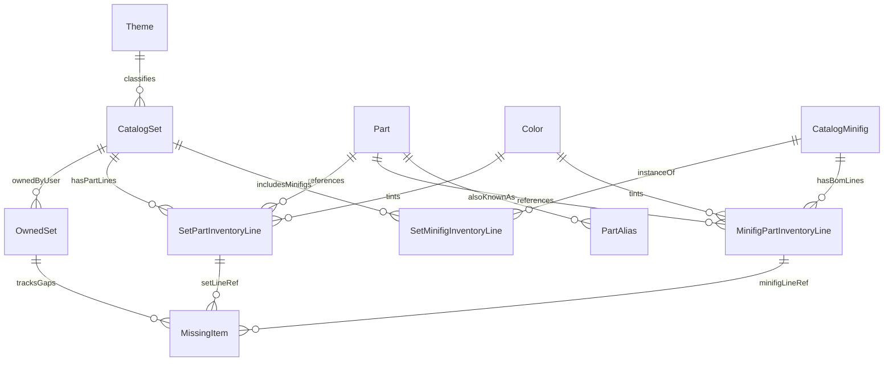

# Database schema — LEGO Collection Manager (MVP)

SQLite is the **single source of truth** for catalog and collection data. Schema follows **normalized** tables with clear separation between **global catalog** (Rebrickable-sourced LEGO data) and **user collection** (ownership and missing parts). All importable rows carry **source metadata**.

## Environment

| Variable | Purpose |
|----------|---------|
| `DATABASE_URL` | SQLAlchemy URL; MVP default `sqlite:///./data/lego.db` (path relative to backend working directory). |

Migrations: **Alembic** tracks revisions; application startup fails fast if the DB is not at head (per [development-plan.md](./development-plan.md)).

## Design principles

1. **Catalog vs collection:** Catalog tables mirror importer entities; collection tables reference catalog by foreign key.
2. **No duplicate catalog primaries:** Upserts keyed by natural keys (`set_num`, `part_num`, `color_id` from API, etc.).
3. **Inventory fidelity:** Spare, alternate, stickered vs plain, and distinct Rebrickable part numbers are preserved on line tables—**no collapsing** of lines in MVP.
4. **Missing parts** belong to an **owned set** and reference a **specific inventory line** (set-level part row or minifig BOM row) for traceability in the UI.

## Entity-relationship overview

## Tables

### `themes`

| Column | Type | Notes |
|--------|------|--------|
| `id` | INTEGER PK | Surrogate key. |
| `external_id` | INTEGER UNIQUE | Rebrickable `theme_id`. |
| `name` | TEXT NOT NULL | Theme name. |
| `source` | TEXT NOT NULL | e.g. `rebrickable`. |
| `fetched_at` | TIMESTAMP NOT NULL | UTC. |

### `catalog_sets`

| Column | Type | Notes |
|--------|------|--------|
| `id` | INTEGER PK | Surrogate key. |
| `set_num` | TEXT NOT NULL UNIQUE | Business key; matches Rebrickable. |
| `name` | TEXT NULL | From API; NULL allowed for **CSV stub** rows until first sync. |
| `year` | INTEGER NULL | |
| `theme_id` | INTEGER FK → `themes.id` NULL | |
| `num_parts` | INTEGER NULL | From API if provided. |
| `image_url` | TEXT NULL | Box art or primary image URL. |
| `source` | TEXT NOT NULL | e.g. `csv_import` (stub) or `rebrickable`. |
| `source_ref` | TEXT NOT NULL | Typically same as `set_num`. |
| `fetched_at` | TIMESTAMP NOT NULL | UTC. |

**CSV import:** may insert **minimal stub** rows (`set_num`, `source` = `csv_import`, `source_ref` = `set_num`, `fetched_at`, other fields NULL) so `owned_sets` can reference `catalog_set_id` before the first Rebrickable sync; sync then upserts full metadata and inventories (`source` becomes `rebrickable` or remains hybrid per implementation, but must satisfy provenance rules in [data-sources.md](./data-sources.md)).

### `owned_sets`

Represents the user owning one catalog set (MVP: **at most one row per `catalog_set_id`**).

| Column | Type | Notes |
|--------|------|--------|
| `id` | INTEGER PK | |
| `catalog_set_id` | INTEGER FK → `catalog_sets.id` NOT NULL UNIQUE | |
| `created_at` | TIMESTAMP NOT NULL | When ownership first recorded. |
| `notes` | TEXT NULL | Optional user note (post-MVP UX optional). |

### `parts`

| Column | Type | Notes |
|--------|------|--------|
| `id` | INTEGER PK | |
| `part_num` | TEXT NOT NULL UNIQUE | Rebrickable primary part id. |
| `name` | TEXT NULL | |
| `image_url` | TEXT NULL | |
| `source` | TEXT NOT NULL | |
| `source_ref` | TEXT NOT NULL | Typically `part_num`. |
| `fetched_at` | TIMESTAMP NOT NULL | |

**Stickered vs plain:** different `part_num` values → different `parts` rows.

### `part_aliases`

Supports search and cross-references when Rebrickable exposes alternate identifiers.

| Column | Type | Notes |
|--------|------|--------|
| `id` | INTEGER PK | |
| `part_id` | INTEGER FK → `parts.id` NOT NULL | |
| `alias` | TEXT NOT NULL | Alternate string. |
| `source` | TEXT NOT NULL | |
| `UNIQUE(alias, source)` | | Prevent duplicate alias rows. |

### `colors`

| Column | Type | Notes |
|--------|------|--------|
| `id` | INTEGER PK | |
| `external_id` | INTEGER UNIQUE | Rebrickable `color_id`. |
| `name` | TEXT NOT NULL | |
| `rgb` | TEXT NULL | If provided. |
| `source` | TEXT NOT NULL | |
| `fetched_at` | TIMESTAMP NOT NULL | |

### `set_part_inventory_lines`

Direct **set → part** inventory (not inside a minifig BOM).

| Column | Type | Notes |
|--------|------|--------|
| `id` | INTEGER PK | |
| `catalog_set_id` | INTEGER FK → `catalog_sets.id` NOT NULL | |
| `part_id` | INTEGER FK → `parts.id` NOT NULL | |
| `color_id` | INTEGER FK → `colors.id` NOT NULL | |
| `quantity` | INTEGER NOT NULL | Must be > 0. |
| `is_spare` | BOOLEAN NOT NULL DEFAULT 0 | |
| `is_alternate` | BOOLEAN NOT NULL DEFAULT 0 | |
| `image_url` | TEXT NULL | Element image for this color. |
| `source` | TEXT NOT NULL | |
| `source_ref` | TEXT NULL | Optional stable id from API if present. |
| `fetched_at` | TIMESTAMP NOT NULL | |
| **UNIQUE** | | `(catalog_set_id, part_id, color_id, is_spare, is_alternate)` — if collisions occur in source data, disambiguate with `source_ref` in a follow-up migration. |

### `catalog_minifigs`

| Column | Type | Notes |
|--------|------|--------|
| `id` | INTEGER PK | |
| `minifig_num` | TEXT NOT NULL UNIQUE | e.g. `fig-000001`. |
| `name` | TEXT NULL | |
| `image_url` | TEXT NULL | |
| `source` | TEXT NOT NULL | |
| `fetched_at` | TIMESTAMP NOT NULL | |

### `set_minifig_inventory_lines`

Which minifigs appear in a set and how many.

| Column | Type | Notes |
|--------|------|--------|
| `id` | INTEGER PK | |
| `catalog_set_id` | INTEGER FK → `catalog_sets.id` NOT NULL | |
| `catalog_minifig_id` | INTEGER FK → `catalog_minifigs.id` NOT NULL | |
| `quantity` | INTEGER NOT NULL | |
| `source` | TEXT NOT NULL | |
| `fetched_at` | TIMESTAMP NOT NULL | |
| **UNIQUE** | | `(catalog_set_id, catalog_minifig_id)` |

### `minifig_part_inventory_lines`

BOM: parts belonging to a minifig design.

| Column | Type | Notes |
|--------|------|--------|
| `id` | INTEGER PK | |
| `catalog_minifig_id` | INTEGER FK → `catalog_minifigs.id` NOT NULL | |
| `part_id` | INTEGER FK → `parts.id` NOT NULL | |
| `color_id` | INTEGER FK → `colors.id` NOT NULL | |
| `quantity` | INTEGER NOT NULL | |
| `is_spare` | BOOLEAN NOT NULL DEFAULT 0 | |
| `image_url` | TEXT NULL | |
| `source` | TEXT NOT NULL | |
| `fetched_at` | TIMESTAMP NOT NULL | |
| **UNIQUE** | | `(catalog_minifig_id, part_id, color_id, is_spare)` |

### `missing_items`

Per **owned set**, references **one** inventory line.

| Column | Type | Notes |
|--------|------|--------|
| `id` | INTEGER PK | |
| `owned_set_id` | INTEGER FK → `owned_sets.id` NOT NULL | |
| `set_part_inventory_line_id` | INTEGER FK → `set_part_inventory_lines.id` NULL | |
| `minifig_part_inventory_line_id` | INTEGER FK → `minifig_part_inventory_lines.id` NULL | |
| `quantity_missing` | INTEGER NOT NULL | > 0; ≤ referenced line `quantity` (enforced in app or trigger). |
| `created_at` | TIMESTAMP NOT NULL | |
| `updated_at` | TIMESTAMP NOT NULL | |
| **CHECK** | | Exactly one of (`set_part_inventory_line_id`, `minifig_part_inventory_line_id`) is NOT NULL. |
| **UNIQUE** | | For a given line, one active missing row: `UNIQUE(owned_set_id, set_part_inventory_line_id)` where line id non-null; separate partial unique on minifig line (SQLite may require application-level enforcement or composite key strategy—implementation may merge into a single `inventory_line_kind` + `inventory_line_id` pattern if partial uniques are awkward). |

**Implementation note:** If SQLite uniqueness with NULLs becomes painful, replace the two nullable FKs with `inventory_line_type` (`set_part` \| `minifig_part`) + `inventory_line_id` INTEGER + application validation.

## Indexes (search and joins)

| Table | Index | Purpose |
|-------|-------|---------|
| `catalog_sets` | `set_num` | Unique lookup; search by set number. |
| `parts` | `part_num` | Lookup; prefix search helper. |
| `part_aliases` | `alias` | Search by alternate id. |
| `set_part_inventory_lines` | `(catalog_set_id)` | Set detail parts query. |
| `set_minifig_inventory_lines` | `(catalog_set_id)` | Set detail minifigs. |
| `minifig_part_inventory_lines` | `(catalog_minifig_id)` | Expand minifig BOM. |
| `owned_sets` | `(catalog_set_id)` | Join owned → catalog. |

SQLite full-text (FTS5) is **optional post-MVP**; MVP may use `LIKE` with normalized uppercase column `part_num_norm` / `alias_norm` populated on write for simpler indexing.

## Deletion and orphan rules

- Deleting an `owned_set` deletes its `missing_items` (CASCADE).
- Catalog rows are generally **not** deleted on failed sync; importer updates in place. Optional future “prune sets no longer owned” job is out of MVP scope.

## Related documents

- [data-sources.md](./data-sources.md)
- [api-design.md](./api-design.md)
- [testing-strategy.md](./testing-strategy.md)
