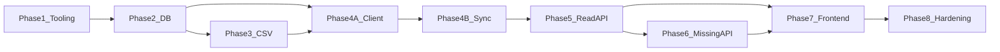

# Development plan — LEGO Collection Manager (MVP)

Ordered phases from an empty repo to a shippable MVP, aligned with the [project rules](../.cursor/rules/project-rules.mdc) and the documents in this folder.

## Phase 1 — Tooling and skeleton

**Deliverables**

- Python **3.12+** project layout under `backend/` (FastAPI application factory, dependency injection for DB session).
- `frontend/` scaffold: **React**, **TypeScript**, **Vite**, router, API client base URL from env.
- `backend/.env.example`: `DATABASE_URL`, `REBRICKABLE_API_KEY`, `UPLOAD_ROOT`, `VITE_API_BASE_URL`, CORS-related vars as needed.
- `.gitignore` excludes `.env`, SQLite files under `data/` if desired, upload directory contents, and virtualenvs.

**Exit criteria**

- `uvicorn` (or documented equivalent) serves health check `GET /health` → `200`.
- Vite dev server runs and can call the backend health endpoint without CORS errors.

## Phase 2 — Database

**Deliverables**

- SQLAlchemy models matching [database-schema.md](./database-schema.md) (including `owned_sets.investigated`, `owned_sets.label`, non-unique `catalog_set_id`, `missing_items.image_path`).
- Alembic initialized; initial migration creates all MVP tables and indexes.
- Configurable `DATABASE_URL` with default SQLite path documented in `backend/.env.example`.

**Exit criteria**

- Fresh DB migrates to head without manual SQL.
- Model-level constraints match the schema doc (FKs; **no** unique constraint on `owned_sets.catalog_set_id`).

## Phase 3 — CSV pipeline

**Deliverables**

- Text parser per [data-sources.md](./data-sources.md): comma- and whitespace-separated set numbers, **no header**, UTF-8.
- Service that creates **stub** `catalog_sets` when needed and **inserts one new** `owned_sets` row per valid token (`investigated` = false).
- `POST /imports/csv` per [api-design.md](./api-design.md) (additive semantics).

**Exit criteria**

- Duplicate `set_num` in one file creates **multiple** `owned_sets` rows.
- Token-level errors reported without aborting valid tokens (unless zero valid tokens).
- Second upload of the same file creates **additional** instances (documented behavior).

## Phase 4A — Rebrickable HTTP client

**Deliverables**

- HTTP client module under `backend/app/rebrickable/` (timeouts, retries/backoff for `429`/`5xx` as minimal courtesy).
- JSON → **DTO** mappers (sets, themes, colors, parts, set-part lines, minifigs, minifig BOM lines).
- Pagination via Rebrickable `next` links; auth via `REBRICKABLE_API_KEY` (`Authorization: key …`).
- Fixture-based tests with **mocked HTTP only** (no live API in CI).

**Exit criteria**

- Client methods return stable DTOs from fixture JSON.
- Missing API key raises a clear configuration error before any network call.
- Multi-page list endpoints are exhausted in tests (mock `next`).

## Phase 4B — Rebrickable sync service

**Deliverables**

- DTO → ORM upsert mappers (sets, themes, colors, parts, aliases, all inventory line types).
- Orchestration service: for each owned set (by distinct `set_num` or per `owned_set_id` scope in API), fetch via the Phase 4A client (set metadata, parts, minifigs, then each minifig’s BOM); upsert with **source metadata**.
- `POST /imports/rebrickable/sync` synchronous implementation per [api-design.md](./api-design.md).

**Exit criteria**

- Second sync run updates `fetched_at` and replaces inventory for that catalog set without duplicate line rows (natural keys respected).
- Missing API key returns `400` with clear message.

## Phase 5 — Read APIs

**Deliverables**

- `GET /owned-sets` with pagination, optional `investigated` filter, `catalog_sync_state` / `missing_count` / `label` fields.
- `GET /owned-sets/{id}` returning instance metadata, catalog block, nested inventories, per-line `missing_quantity` / `missing_item_id` / `missing_image_url`.
- `PATCH /owned-sets/{id}` for `investigated` and `label`.
- `POST /owned-sets/{id}/duplicate` — new instance, `investigated` false, no missing rows copied.
- `GET /search` per [api-design.md](./api-design.md) (multiple instances per `set_num` in set results).

**Exit criteria**

- `404` for unknown owned set id.
- Duplicate returns `201` with new `id`; source instance unchanged; new row has `investigated` false and `missing_count` 0.
- Search rejects empty `q` with `400`.

## Phase 6 — Missing parts API and local images

**Deliverables**

- `PATCH /owned-sets/{id}/missing` implementing upsert/clear rules and quantity validation.
- `PUT` / `DELETE` missing-part image endpoints; `GET /media/missing/{missing_item_id}`; files under `UPLOAD_ROOT`.

**Exit criteria**

- Cannot persist `quantity_missing` greater than the referenced inventory line’s `quantity`.
- Clearing with `quantity_missing: 0` removes the missing row and any image file.
- Upload replaces prior file; delete image leaves missing quantity unchanged.

## Phase 7 — Frontend MVP UI

**Deliverables**

- **Owned sets list** page with pagination, investigation badge, optional filter, labels for duplicate `set_num`.
- **Set detail** page: metadata, investigation toggle, label edit, **add another copy**, inventory tables, **missing** panel with quantity controls and **per-line photo upload/preview**.
- **Owned sets list:** **add another copy** action per row.
- **Search** UI (single field; tabs or toggle for set vs part optional).
- **Import** UI: file picker for comma-separated set list; button to trigger Rebrickable sync.

**Exit criteria**

- End-to-end manual flow: CSV (additive) → sync → duplicate an owned set from UI → new uninvestigated copy → mark missing + upload photo → reload shows persisted state and local image.

## Phase 7b — Instance management UX (feedback)

**Deliverables**

- Schema: `owned_sets.age` (INTEGER NULL) + Alembic migration; Rebrickable age strings (`6+`) parsed to integer on sync.
- Shared-field PATCH (e.g. age → all instances); `set_num` change with instance-only re-link + UI warning.
- DELETE removes catalog + inventory when last instance for that catalog set is removed.
- API: `copy_index` / `display_label` on list and detail; `PATCH` adds `age` and `notes`; `DELETE /owned-sets/{id}`; `GET .../duplicate-preview` + `POST .../duplicate` with optional `label` body.
- Frontend: list layout (`{display_label} — {set_num}`, metadata line); rename **Make a copy** + confirmation modal; remove duplicate from detail; instance editor on detail; delete with confirmation.

**Exit criteria**

- List shows label before set number and name/theme/parts/age with documented defaults.
- Make a copy only from list; dialog shows set number X and default `Copy #n`; create only after confirm.
- Detail allows editing instance fields and deleting the instance; no Make a copy on detail.
- Tests cover delete, duplicate preview/POST with label, PATCH age, and updated list/detail UI (mocked API).

## Phase 8 — Hardening and documentation

**Deliverables**

- Structured logging for importer (no secrets).
- README sections: prerequisites, how to run backend/frontend, how to run migrations, where the SQLite file and upload directory live.
- GitHub Actions CI on push/PR: backend `pytest` and frontend `npm run build` (see [ci.md](./ci.md), [`.github/workflows/ci.yml`](../.github/workflows/ci.yml)); extend with Vitest when configured.

**Exit criteria**

- New developer can run the stack from README alone.
- No committed secrets; `backend/.env.example` complete.
- GitHub Actions workflow (see [ci.md](./ci.md)) runs on push and pull request.

## Dependency graph (high level)

## Related documents

- [README.md](./README.md) — index of all specification files in `docs/`
- [ci.md](./ci.md)
- [product-requirements.md](./product-requirements.md)
- [testing-strategy.md](./testing-strategy.md)
