# Development plan — LEGO Collection Manager (MVP)

Ordered phases from an empty repo to a shippable MVP, aligned with the [project rules](../.cursor/rules/project-rules.mdc) and the documents in this folder.

## Phase 1 — Tooling and skeleton

**Deliverables**

- Python **3.12+** project layout under `backend/` (FastAPI application factory, dependency injection for DB session).
- `frontend/` scaffold: **React**, **TypeScript**, **Vite**, router, API client base URL from env.
- `backend/.env.example`: `DATABASE_URL`, `REBRICKABLE_API_KEY`, `VITE_API_BASE_URL`, CORS-related vars as needed. (MVP also used `UPLOAD_ROOT` for disk missing photos; **Phase 10** moved images into SQLite BLOBs.)
- `.gitignore` excludes `.env`, SQLite files under `data/` if desired, upload directory contents, and virtualenvs.

**Exit criteria**

- `uvicorn` (or documented equivalent) serves health check `GET /health` → `200`.
- Vite dev server runs and can call the backend health endpoint without CORS errors.

## Phase 2 — Database

**Deliverables**

- SQLAlchemy models matching [database-schema.md](./database-schema.md) (including `owned_sets.investigated`, `owned_sets.label`, non-unique `catalog_set_id`, `missing_items.image_path`).
- Alembic initialized; initial migration creates all MVP tables and indexes.
- Configurable `DATABASE_URL` with default SQLite path documented in `backend/.env.example`.

**Exit criteria**

- Fresh DB migrates to head without manual SQL.
- Model-level constraints match the schema doc (FKs; **no** unique constraint on `owned_sets.catalog_set_id`).

## Phase 3 — CSV pipeline

**Deliverables**

- Text parser per [data-sources.md](./data-sources.md): comma- and whitespace-separated set numbers, **no header**, UTF-8.
- Service that creates **stub** `catalog_sets` when needed and **inserts one new** `owned_sets` row per valid token (`investigated` = false).
- `POST /imports/csv` per [api-design.md](./api-design.md) (additive semantics).

**Exit criteria**

- Duplicate `set_num` in one file creates **multiple** `owned_sets` rows.
- Token-level errors reported without aborting valid tokens (unless zero valid tokens).
- Second upload of the same file creates **additional** physical copies (`owned_sets` rows; documented behavior).

## Phase 4A — Rebrickable HTTP client

**Deliverables**

- HTTP client module under `backend/app/rebrickable/` (timeouts, retries/backoff for `429`/`5xx` as minimal courtesy).
- JSON → **DTO** mappers (sets, themes, colors, parts, set-part lines, minifigs, minifig BOM lines).
- Pagination via Rebrickable `next` links; auth via `REBRICKABLE_API_KEY` (`Authorization: key …`).
- Fixture-based tests with **mocked HTTP only** (no live API in CI).

**Exit criteria**

- Client methods return stable DTOs from fixture JSON.
- Missing API key raises a clear configuration error before any network call.
- Multi-page list endpoints are exhausted in tests (mock `next`).

## Phase 4B — Rebrickable sync service

**Deliverables**

- DTO → ORM upsert mappers (sets, themes, colors, parts, aliases, all inventory line types).
- Orchestration service: for each LEGO `set_num` in scope (distinct catalog sets referenced by collection copies, or filtered by optional `owned_set_ids` in the API body), fetch via the Phase 4A client (set metadata, parts, minifigs, then each minifig’s BOM); upsert with **source metadata**.
- `POST /imports/rebrickable/sync` synchronous implementation per [api-design.md](./api-design.md).

**Exit criteria**

- Second sync run updates `fetched_at` and replaces inventory for that catalog set without duplicate line rows (natural keys respected).
- Missing API key returns `400` with clear message.

## Phase 5 — Read APIs

**Deliverables**

- `GET /owned-sets` with pagination, optional `investigated` filter, `catalog_sync_state` / `missing_count` / `label` fields.
- `GET /owned-sets/{id}` returning per-copy metadata, catalog block, nested inventories, per-line `missing_quantity` / `missing_item_id` / `missing_image_url`.
- `PATCH /owned-sets/{id}` for `investigated` and `label`.
- `POST /owned-sets/{id}/duplicate` — new physical copy (`owned_sets`), `investigated` false, no missing rows copied.
- `GET /search` per [api-design.md](./api-design.md) (multiple copies per `set_num` in set results).

**Exit criteria**

- `404` for unknown set copy id.
- Duplicate returns `201` with new `id`; source copy unchanged; new row has `investigated` false and `missing_count` 0.
- Search rejects empty `q` with `400`.

## Phase 6 — Missing parts API and local images

**Deliverables**

- `PATCH /owned-sets/{id}/missing` implementing upsert/clear rules and quantity validation.
- `PUT` / `DELETE` missing-part image endpoints; `GET /media/missing/{missing_item_id}`; files under `UPLOAD_ROOT`. *(Superseded by Phase 10 BLOB storage — see Phase 10.)*

**Exit criteria**

- Cannot persist `quantity_missing` greater than the referenced inventory line’s `quantity`.
- Clearing with `quantity_missing: 0` removes the missing row and any image file.
- Upload replaces prior file; delete image leaves missing quantity unchanged.

## Phase 7 — Frontend MVP UI

**Deliverables**

- **Sets list** page with pagination, investigation badge, optional filter, labels for duplicate `set_num`.
- **Set detail** page: metadata, investigation toggle, label edit, inventory tables, **missing** panel with quantity controls and **per-line photo upload/preview**.
- **Sets list:** **Make a copy** action per row.
- **Search** UI (single field; tabs or toggle for set vs part optional).
- **Import** UI: file picker for comma-separated set list; button to trigger Rebrickable sync.

**Exit criteria**

- End-to-end manual flow: CSV (additive) → sync → duplicate a copy from the list → new uninvestigated copy → mark missing + upload photo → reload shows persisted state and local image.

## Phase 7b — Copy management UX (feedback) — **complete**

**Deliverables**

- Schema: `owned_sets.age` (INTEGER NULL) + Alembic migration; Rebrickable age strings (`6+`) parsed to integer on sync.
- Shared-field PATCH (e.g. age → all copies); `set_num` change with copy-only re-link + UI warning.
- DELETE removes catalog + inventory when the last copy for that catalog set is removed.
- API: `copy_index` / `display_label` on list and detail; `PATCH` adds `age` and `notes`; `DELETE /owned-sets/{id}`; `GET .../duplicate-preview` + `POST .../duplicate` with optional `label` body.
- Frontend: list layout (`{display_label} — {set_num}`, metadata line); rename **Make a copy** + confirmation modal; remove duplicate from detail; per-copy editor on detail; delete with confirmation.

**Exit criteria**

- List shows label before set number and name/theme/parts/age with documented defaults.
- Make a copy only from list; dialog shows set number X and default `Copy #n`; create only after confirm.
- Detail allows editing per-copy fields and deleting that copy; no Make a copy on detail.
- Tests cover delete, duplicate preview/POST with label, PATCH age, PATCH theme when `theme_id` is NULL, and updated list/detail UI (mocked API).

**Follow-up (post-merge):** theme PATCH when catalog had no linked theme (CSV stubs); dual-source metadata documented in [data-sources.md](./data-sources.md#catalog-metadata-dual-source).

## Phase 8 — Hardening and documentation — **complete**

**Deliverables**

- Structured logging for importer (no secrets); `LOG_LEVEL` in `.env.example`.
- Startup migration gate: API fails fast unless DB is at Alembic head (`SKIP_DB_MIGRATION_CHECK` for tests).
- README sections: prerequisites, how to run backend/frontend, migrations, `DATABASE_URL`, configuration table.
- GitHub Actions CI on push/PR: backend `pytest`, frontend `npm test`, and `npm run build` (see [ci.md](./ci.md), [`.github/workflows/ci.yml`](../.github/workflows/ci.yml)).

**Exit criteria**

- New developer can run the stack from README alone.
- No committed secrets; `backend/.env.example` complete.
- GitHub Actions workflow (see [ci.md](./ci.md)) runs on push and pull request.

---

## Post-MVP overview (Phases 9–13; sync **14**)

Phases **1–8** delivered the original MVP (including the Rebrickable sync endpoint and earlier disk-based missing photos). Phases **9–13** refactor collection semantics around:

- **Rebrickable as the catalog source** (metadata + full inventory; optional image downloads only through the sync controls).
- **Every `catalog_sets` row has at least one `owned_sets` row** — everything persisted is in the user’s collection; there is no separate “unowned” catalog.
- **Per-copy inventory** (part quantities and missing counts), while **set-level metadata** and **part-level images/aliases** follow the sharing rules in [product-requirements.md §11](./product-requirements.md#11-post-mvp-collection-semantics-phases-914).
- **Images in SQLite** (JPEG/PNG BLOBs), not on disk under `MEDIA_ROOT` / thumbnails.
- **Sync UX:** **Phase 14** ships **Import → Sync entire collection** (`POST /imports/rebrickable/sync` for full DB sync with image-option defaults), current-set sync from detail (`owned_set_ids` with the current set copy id), and optional set/minifigure/part image downloads. Progress/cancel, conflict policy, and richer subset selection remain backlog (see Phase **14** below).

Implement **one phase at a time**; update [database-schema.md](./database-schema.md), [api-design.md](./api-design.md), and tests before marking a phase complete.

## Phase 9 — Per-copy inventory and editing — **complete**

**Goal:** Quantities and missing counts are **per physical copy** (`owned_sets`), not shared on catalog inventory lines.

**Deliverables**

- Schema: per-copy inventory (`owned_set_inventory_lines` linking `owned_set_id` to a catalog inventory line key — set-part or minifig-part — with `quantity` and optional denormalized keys for queries). Catalog lines (`set_part_inventory_lines`, etc.) remain the **template** populated from Rebrickable; each new **`owned_sets`** row gets per-copy inventory lines copied from the catalog template (duplicate and CSV/manual flows).
- APIs: `PATCH` (or dedicated endpoints) to update **`owned_set_inventory_lines`** `quantity` and `quantity_missing` per line; validation `0 ≤ quantity_missing ≤ quantity`.
- Migrate existing `missing_items` to align with per-copy inventory (or fold missing quantity into those lines — document chosen model in schema).
- Frontend: set detail inventory table edits **this copy’s** quantities and missing counts; shared catalog fields unchanged in behavior from Phase 7b.
- Tests: isolation between copies (editing Copy #1 does not change Copy #2); validation; duplicate creates fresh per-copy inventory lines from the template quantities.

**Exit criteria**

- Two copies of the same `set_num` can have different part quantities and missing counts.
- Editing set name/theme/year/age/set image on one copy still updates **all** copies of that `set_num` (unchanged from MVP).
- All backend tests pass; no live Rebrickable calls.

## Phase 10 — Images in database (parts and sets) — **complete**

**Goal:** Store user and optional catalog images as **BLOBs in SQLite**; remove reliance on `UPLOAD_ROOT` / filesystem for product images.

**Deliverables**

- Schema: BLOB + `content_type` (+ optional `byte_size`) on `parts` for **part image** (global: one image per part, shown in every set that uses that part). BLOB on `catalog_sets` for **set box image** (shared across all copies of that `set_num`). Drop or migrate away `missing_items.image_path` and disk storage; missing lines use the **part** image when present, or per-line upload if spec’d separately (default: upload attaches to `parts` when the line’s part is identified).
- APIs: `PUT` / `GET` / `DELETE` image endpoints for parts and sets; max **5 MB**, min **0** bytes allowed; JPEG and PNG only.
- Remove `UPLOAD_ROOT` from required config (or keep only for legacy migration script). No `MEDIA_ROOT`, thumbnails, or CDN cache folders.
- Optional: stop persisting Rebrickable `image_url` on new fetches if redundant (not required for exit).
- Frontend: upload/preview on inventory lines (emphasis on missing parts); set image edit on detail (shared).
- Tests: round-trip upload/serve/delete; size and MIME validation; part image visible on two sets sharing `part_id`.

**Exit criteria**

- Missing-part photo survives DB backup/restore without a separate upload directory.
- Replacing a part image updates display for that part in **all** sets in the UI.
- Disk upload directory is not required for normal operation.

## Phase 11A — Inventory part modal (add / edit / delete)

**Goal:** Unified **PartLineModal** for set-parts inventory: add with optional image, click row to edit or delete, show Element IDs read-only in the table.

**Deliverables**

- APIs: extend `POST /owned-sets/{id}/set-parts` **201** with `part_id` and `catalog_line_id`; add `PATCH` and `DELETE` on `.../set-parts/{instance_line_id}` (see [api-design.md](./api-design.md)).
- Detail payload: `SetPartLineDetail.aliases` (read-only strings from `part_aliases`, excluding `part_num`).
- Frontend: replace `AddPartLineDialog` with `PartLineModal` (`create` | `edit`); row click opens edit (**Update** / **Delete** / **Cancel**); optional image on add via existing `PUT /parts/{part_id}/image` after create; remove inline `PartImageEditor` from table (modal is primary).
- `PATCH .../inventory-lines/{id}` remains for **missing quantity** inline editor; modal uses set-parts PATCH for line metadata and per-copy `quantity`.
- Tests: set-parts CRUD; detail includes aliases; image-on-add flow (mocked PUT); modal Vitest.

**Exit criteria**

- User can add a part with optional photo; photo appears for that `part_id` everywhere.
- Clicking a set-part row opens edit modal; delete removes the **`owned_set_inventory_lines`** row and orphan catalog line when unused.
- Table shows Element IDs; aliases are edited in the part modal.
- No live Rebrickable in tests.

## Phase 11B — Part alias editing in modal

**Goal:** Edit part aliases in the same **PartLineModal** using symmetric equivalence classes (PRD §11.5).

**Deliverables**

- API: `PATCH /api/parts/{part_id}/aliases` with replace-list body `{ "aliases": [...] }` and server-side closure (see [api-design.md](./api-design.md)).
- Service: `part_alias_service.replace_aliases` — manual rows use `source='user'`; merge classes when an alias string links to another part (documented policy).
- Frontend: **AliasChipEditor** in create and edit modals; submit order: create — `POST set-parts` → `PATCH aliases` → `PUT image`; edit — `PATCH set-parts` → `PATCH aliases` → image as needed.
- Tests: symmetry property tests (add B to X ⇒ X on B; remove A from X ⇒ X removed from A); search by alias across class.

**Exit criteria**

- Alias chip editor works in add and edit modals.
- Undirected alias group stays consistent after edits.
- Search finds parts by any alias in the class.

## Phase 12 — CSV import with full Rebrickable fetch (no images)

**Goal:** CSV import creates **physical copies (`owned_sets`)** **and** loads full catalog + inventory from Rebrickable per token — **without** downloading images.

**Deliverables**

- `POST /imports/csv`: after each valid token for a new catalog set, call Rebrickable (set metadata, set parts, minifigs, minifig BOMs) using the Phase 4A client; upsert catalog + template inventory; create per-copy inventory rows from template (Phase 9). Existing catalog sets are skipped by default, or copied locally when the user selects `existing_set_mode=copy`. **Do not** HTTP-fetch `part_img_url` / set image URLs into files or BLOBs.
- Replace **stub-only** catalog creation: new sets get name, theme, year, `num_parts`, **age only when Rebrickable returns `age_range`**, and full part/minifig lists when the API succeeds; per-token failures reported without aborting other tokens (same partial-success pattern as today). Manual age entry on set detail when the API has no age.
- Requires `REBRICKABLE_API_KEY`; clear error if missing.
- Frontend: Import page copy explains that CSV adds copies and fetches set data (no images). **Sync entire collection** remains on Import with image download controls; current-set scoped sync is available from set detail.
- Tests: mocked multi-endpoint Rebrickable sequence per token; assert inventory row counts; assert no image BLOBs/URLs written when policy is “no images on import.”

**Exit criteria**

- Importing `6024-1` via CSV yields a browsable set detail with full part list (from fixtures/mocks in CI) without running `POST /imports/rebrickable/sync`.
- Second CSV with same `set_num` creates a **second copy** with its own per-copy inventory rows.
- No filesystem image cache created during import.

## Phase 13 — Manual add set wizard — **complete**

**Goal:** User can add a set by number only; branch on whether `set_num` already exists; support manual catalog entry and initial inventory via wizard, API-only clients, CSV, sync, or set detail modal. **Part alias editing** is Phase **11B**, not this phase.

**Deliverables**

- **`GET /owned-sets/add-preview`**, **`GET /owned-sets/add-rebrickable-draft`** (live Rebrickable prefill when catalog does **not** exist locally), **`POST /owned-sets`**.
- **Add set wizard (`AddSetWizard`):** modal/page from sets list/import, `/add` route, Import page link (`frontend/src/pages/AddSetPage.tsx`).
  1. Step 1: required **LEGO set number**.
  2. If `set_num` **exists:** message + read-only catalog + template parts preview + copy **label**; **POST** with `set_num` + optional `label` only.
  3. If `set_num` **new:** editable **catalog** fields (including **year**), **label**, **optional part rows**, **Fetch from Rebrickable** (`add-rebrickable-draft` → fills metadata + filtered set-part lines; minifigs still come from CSV/sync per response **note**). Two steps + Submit (no standalone confirm-only step).

**Implementation notes**

- `POST …/owned-sets` still rejects **`catalog` / `parts`** when adding another copy of an existing **`set_num`**.
- Automated tests: [`backend/tests/test_manual_add_api.py`](../backend/tests/test_manual_add_api.py), [`backend/tests/test_manual_add_rebrickable_draft.py`](../backend/tests/test_manual_add_rebrickable_draft.py), Vitest `frontend/src/pages/AddSetPage.test.tsx`.

**Collection invariant**

- Deleting the last copy for a `set_num` deletes catalog + inventory for that set (existing rule); no orphan `catalog_sets` without `owned_sets`.

**Exit criteria**

- User can create a **new** `set_num` from the wizard with optional catalog metadata and optional **inventory lines** (`parts`), or prefilled lines from **`add-rebrickable-draft`**.
- User can still add inventory later via **PartLineModal**, **CSV**, or **sync**.
- User can create **another copy** of an existing `set_num` via the wizard **or** **Make a copy** on the list.

---

## Phase 14 — Sync UX and polish

### Shipped

- **Import** page exposes **Sync entire collection** (empty body syncs everything in the DB).
- **Set detail** exposes collapsed-by-default **Sync from Rebrickable** for the current set copy (`{ "owned_set_ids": [currentCopyId] }`).
- Both sync surfaces expose **download set images** and **part image download mode** controls. Set image download defaults on and includes catalog minifigure thumbnails. Part image download defaults to **none** with options for **missing** and **all**, and both modes include minifig BOM parts.

### Deferred backlog

- UX to pick an arbitrary **subset** of set copies from list views.
- **Progress**, **cancel**, and long-running-job messaging beyond a simple spinner on Import.
- **Conflict / refresh policies** when Rebrickable data differs from manual edits (document and enforce UX).
- Additional image polish, such as retry controls for failed CDN → BLOB downloads.

See [api-design.md](./api-design.md) for sync contract. Phase **12** (CSV fetch) reduces need for wizard-only Rebrickable prefill for common flows.

## Dependency graph (high level)

```mermaid
flowchart LR
  subgraph mvp [MVP Phases 1-8]
    phase1[Phase1_Tooling]
    phase2[Phase2_DB]
    phase3[Phase3_CSV]
    phase4a[Phase4A_Client]
    phase4b[Phase4B_Sync]
    phase5[Phase5_ReadAPI]
    phase6[Phase6_MissingAPI]
    phase7[Phase7_Frontend]
    phase8[Phase8_Hardening]
    phase1 --> phase2
    phase2 --> phase3
    phase2 --> phase4a
    phase3 --> phase4a
    phase4a --> phase4b
    phase4b --> phase5
    phase5 --> phase6
    phase5 --> phase7
    phase6 --> phase7
    phase7 --> phase8
  end
  subgraph post ["Post-MVP Phases 9-14"]
    phase9[Phase9_InstanceInventory]
    phase10[Phase10_ImagesInDB]
    phase11A[Phase11A_PartModal]
    phase11B[Phase11B_Aliases]
    phase12[Phase12_CSVFetch]
    phase13[Phase13_ManualAddWizard]
    phase9 --> phase10
    phase10 --> phase11A
    phase11A --> phase11B
    phase11B --> phase12
    phase12 --> phase13
  end
  phase8 --> phase9
  phase4a --> phase12
```

**Note:** Phase 12 (CSV fetch) depends on Phase 4A (client) and Phase 9 (`owned_set_inventory_lines`). Phases 11A–11B depend on Phase 10 (part image BLOBs). Phase 10 can proceed after Phase 9 so missing/part uploads target BLOB columns. Phase **13** (**add-rebrickable-draft**) shares the Phase 4A client with Phase **12**; CSV remains best for importing many sets in one shot with full BOM; the wizard prefills metadata + **set-part** inventory only (**minifigs** via CSV/sync).

## Related documents

- [README.md](./README.md) — index of all specification files in `docs/`
- [ci.md](./ci.md)
- [product-requirements.md](./product-requirements.md)
- [testing-strategy.md](./testing-strategy.md)
