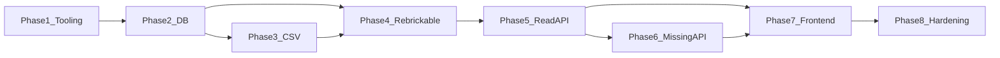

# Development plan — LEGO Collection Manager (MVP)

Ordered phases from an empty repo to a shippable MVP, aligned with the [project rules](../.cursor/rules/project-rules.mdc) and the documents in this folder.

## Phase 1 — Tooling and skeleton

**Deliverables**

- Python **3.12+** project layout under `backend/` (FastAPI application factory, dependency injection for DB session).
- `frontend/` scaffold: **React**, **TypeScript**, **Vite**, router, API client base URL from env.
- Root **`.env.example`**: `DATABASE_URL`, `REBRICKABLE_API_KEY`, `VITE_API_BASE_URL`, CORS-related vars as needed.
- `.gitignore` excludes `.env`, SQLite files under `data/` if desired, and virtualenvs.

**Exit criteria**

- `uvicorn` (or documented equivalent) serves health check `GET /health` → `200`.
- Vite dev server runs and can call the backend health endpoint without CORS errors.

## Phase 2 — Database

**Deliverables**

- SQLAlchemy models matching [database-schema.md](./database-schema.md).
- Alembic initialized; initial migration creates all MVP tables and indexes.
- Configurable `DATABASE_URL` with default SQLite path documented in `.env.example`.

**Exit criteria**

- Fresh DB migrates to head without manual SQL.
- Model-level constraints match the schema doc (FKs, uniqueness where specified).

## Phase 3 — CSV pipeline

**Deliverables**

- CSV parser module (delimiter, header detection, UTF-8) per [data-sources.md](./data-sources.md).
- Service that creates/updates **stub** `catalog_sets` and `owned_sets` rows idempotently.
- `POST /imports/csv` per [api-design.md](./api-design.md).

**Exit criteria**

- Duplicate `set_num` in one file does not create duplicate `owned_sets`.
- Row-level errors reported without aborting the whole file (unless zero valid rows).

## Phase 4 — Rebrickable client and sync

**Deliverables**

- HTTP client module (timeouts, retries/backoff for `429`/`5xx` as minimal courtesy).
- Mappers from JSON responses to ORM objects (sets, themes, colors, parts, aliases, all inventory line types).
- Orchestration service: for each owned set, fetch set metadata, parts, minifigs, then each minifig’s BOM; upsert with **source metadata**.
- `POST /imports/rebrickable/sync` synchronous implementation per [api-design.md](./api-design.md).

**Exit criteria**

- Second sync run updates `fetched_at` and replaces inventory for that set without duplicate line rows (natural keys respected).
- Missing API key returns `400` with clear message.

## Phase 5 — Read APIs

**Deliverables**

- `GET /owned-sets` with pagination and `catalog_sync_state` / `missing_count` fields.
- `GET /owned-sets/{id}` returning catalog block plus nested inventories and per-line `missing_quantity` aggregation.
- `GET /search` per [api-design.md](./api-design.md).

**Exit criteria**

- `404` for unknown owned set id.
- Search rejects empty `q` with `400`.

## Phase 6 — Missing parts API

**Deliverables**

- `PATCH /owned-sets/{id}/missing` implementing upsert/clear rules and quantity validation.

**Exit criteria**

- Cannot persist `quantity_missing` greater than the referenced inventory line’s `quantity`.
- Clearing with `quantity_missing: 0` removes the missing row.

## Phase 7 — Frontend MVP UI

**Deliverables**

- **Owned sets list** page with pagination.
- **Set detail** page: metadata, tables for set parts and minifigs (with expandable BOM or flat nested section), badges for spare/alternate.
- **Search** UI (single field; tabs or toggle for set vs part optional).
- **Import** UI: file picker for CSV; button to trigger Rebrickable sync (global or per selection as time permits—document chosen UX).

**Exit criteria**

- End-to-end manual flow: CSV → sync → browse → search → mark missing → verify persistence after reload.

## Phase 8 — Hardening and documentation

**Deliverables**

- Structured logging for importer (no secrets).
- README sections: prerequisites, how to run backend/frontend, how to run migrations, where the SQLite file lives.
- Optional: GitHub Action stub (document only or minimal workflow) running pytest + vitest on push.

**Exit criteria**

- New developer can run the stack from README alone.
- No committed secrets; `.env.example` complete.

## Dependency graph (high level)

## Related documents

- [product-requirements.md](./product-requirements.md)
- [testing-strategy.md](./testing-strategy.md)
